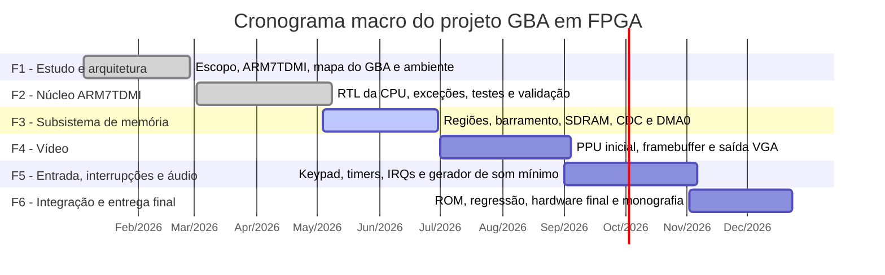

# Cronograma detalhado do projeto

Estado base: 2026-06-17.

Este cronograma detalha o cronograma macro da monografia em atividades editáveis. As colunas `Objetivo` e `Dependências` foram removidas para deixar a planilha mais direta. As datas assumem que o mês 1 do projeto é janeiro de 2026 e que a fase F3 ocorre em maio e junho de 2026.

## Visão por fase

## Marcos principais

| Marco | Data prevista | Critério de conclusão |
| --- | --- | --- |
| Fechamento F1 | 2026-02-27 | Arquitetura alvo e plano de validação definidos |
| Fechamento F2 | 2026-05-01 | Núcleo ARM7TDMI validado em simulação e hardware |
| Fechamento F3 | 2026-06-30 | Subsistema de memória integrado, com pendências críticas resolvidas ou registradas |
| Fechamento F4 | 2026-08-31 | Imagem estável produzida em monitor via VGA |
| Fechamento F5 | 2026-10-30 | Entrada do usuário e áudio mínimo demonstrados em hardware |
| Entrega final | 2026-12-23 | Projeto, documentação, apresentação e evidências de validação prontos |

## Atividades detalhadas

| ID | Fase | Pacote | Atividade | Início | Fim | Status | Entregável |
| --- | --- | --- | --- | --- | --- | --- | --- |
| C01 | F1 | Planejamento | Definir escopo da prova de conceito, restrições da DE1-SoC e critérios mínimos de demonstração | 2026-01-05 | 2026-01-16 | Concluída | Escopo inicial do projeto |
| C02 | F1 | Estudo ARM7TDMI | Levantar modos de operação, banco de registradores, exceções, pipeline e conjunto ARM | 2026-01-19 | 2026-02-06 | Concluída | Resumo técnico ARM7TDMI |
| C03 | F1 | Estudo GBA | Mapear regiões de memória do GBA, larguras de barramento e requisitos de cartucho | 2026-01-26 | 2026-02-13 | Concluída | Mapa de memória alvo |
| C04 | F1 | Ambiente | Configurar Quartus, simulação, scripts de montagem e projeto DE1-SoC | 2026-02-09 | 2026-02-20 | Concluída | Ambiente de desenvolvimento funcional |
| C05 | F1 | Arquitetura | Consolidar arquitetura objetivo, camadas do sistema e plano de validação incremental | 2026-02-23 | 2026-02-27 | Concluída | Diagrama de arquitetura e plano macro |
| C06 | F2 | CPU RTL | Implementar banco de registradores com modos privilegiados e registradores espelhados | 2026-03-02 | 2026-03-13 | Concluída | Módulo de banco de registradores |
| C07 | F2 | CPU RTL | Implementar ALU, flags NZCV, barrel shifter e multiplicador 32x32 | 2026-03-09 | 2026-03-27 | Concluída | Blocos operacionais do datapath |
| C08 | F2 | CPU RTL | Implementar decodificação e controle multi-ciclo para instruções ARM | 2026-03-23 | 2026-04-10 | Concluída | Decoder ARM integrado ao datapath |
| C09 | F2 | CPU RTL | Implementar suporte Thumb e transição entre estados ARM e Thumb | 2026-04-06 | 2026-04-17 | Concluída | Decoder Thumb integrado |
| C10 | F2 | Exceções | Implementar Reset, SWI, Undefined, Abort, IRQ e FIQ | 2026-04-13 | 2026-04-24 | Concluída | Tratamento completo de exceções |
| C11 | F2 | Validação CPU | Criar e executar programas de teste ARM e Thumb com geração de HEX/MIF | 2026-04-20 | 2026-04-30 | Concluída | Conjunto de programas de regressão |
| C12 | F2 | Hardware CPU | Sintetizar núcleo na DE1-SoC e validar com SignalTap e displays HEX | 2026-04-27 | 2026-05-01 | Concluída | Demonstração intermediária da CPU |
| C13 | F2 | Documentação | Atualizar monografia e material intermediário com estado da CPU | 2026-04-27 | 2026-05-08 | Concluída | Texto e figuras da entrega intermediária |
| C14 | F3 | Memória interna | Implementar ou revisar módulos BIOS, EWRAM, IWRAM, I/O, Palette, VRAM, OAM e Cart RAM | 2026-05-04 | 2026-05-15 | Concluída | Módulos de região sintetizáveis |
| C15 | F3 | Barramento | Implementar bus_controller com decodificação por região, MAS e mux de leitura | 2026-05-11 | 2026-05-22 | Concluída | Controlador de barramento integrado |
| C16 | F3 | SDRAM | Integrar controlador SDRAM para PAK_ROM e definir interface host de 16 bits | 2026-05-18 | 2026-05-29 | Concluída | Controlador SDRAM no projeto |
| C17 | F3 | CDC SDRAM | Validar wrapper CDC com sincronização de requisições, busy e rd_ready | 2026-05-25 | 2026-06-12 | Concluída | Wrapper SDRAM revisado |
| C18 | F3 | DMA | Integrar bus_arbiter e DMA0 ao caminho de dados compartilhado | 2026-06-01 | 2026-06-12 | Concluída | DMA0 conectado ao barramento |
| C19 | F3 | DMA | Corrigir campos de controle, tamanho de transferência e mux de leitura halfword do DMA0 | 2026-06-08 | 2026-06-19 | Em andamento | DMA0 imediato funcional |
| C20 | F3 | Validação memória | Criar testbench integrado para DMA0, bus_arbiter, bus_controller e regiões de memória | 2026-06-09 | 2026-06-23 | Em andamento | Testbench de integração de memória |
| C21 | F3 | Hardware memória | Executar síntese, teste em placa e captura SignalTap do caminho CPU para memória e SDRAM | 2026-06-16 | 2026-06-30 | Prevista | Relatório de validação da Camada 2 |
| C22 | F3 | Marco F3 | Congelar escopo da Camada 2 para iniciar vídeo com base estável | 2026-06-29 | 2026-06-30 | Prevista | Marco de fechamento F3 |
| C23 | F4 | Vídeo planejamento | Definir escopo mínimo do PPU para a prova de conceito, priorizando Modo 3 bitmap 16 bpp | 2026-07-01 | 2026-07-03 | Prevista | Especificação mínima de vídeo |
| C24 | F4 | VGA | Implementar gerador de sincronismo VGA e blanking compatível com monitor | 2026-07-06 | 2026-07-17 | Prevista | Módulo de timing VGA |
| C25 | F4 | Framebuffer | Mapear framebuffer 240x160 na VRAM e definir caminho de escrita pela CPU | 2026-07-13 | 2026-07-31 | Prevista | VRAM endereçável como framebuffer |
| C26 | F4 | PPU | Implementar pipeline de leitura de pixel e conversão RGB 15 bpp para saída VGA | 2026-07-27 | 2026-08-14 | Prevista | PPU Modo 3 inicial |
| C27 | F4 | Vídeo testes | Criar programas ARM para preencher VRAM com barras, gradiente e imagem simples | 2026-08-10 | 2026-08-21 | Prevista | Testes de vídeo em assembly |
| C28 | F4 | Hardware vídeo | Integrar PPU ao top-level, compilar no Quartus e validar saída VGA na DE1-SoC | 2026-08-17 | 2026-08-31 | Prevista | Demonstração de vídeo em monitor |
| C29 | F4 | Marco F4 | Atualizar monografia com arquitetura de vídeo, limitações e resultados | 2026-08-24 | 2026-09-04 | Prevista | Seção de vídeo revisada |
| C30 | F5 | Interrupções | Ligar eventos de VBlank, HBlank e temporizadores básicos ao controlador de interrupções | 2026-09-01 | 2026-09-18 | Prevista | Interrupções úteis ao sistema |
| C31 | F5 | Entrada | Implementar leitura de botões da DE1-SoC como registrador de keypad compatível com o mapa de I/O | 2026-09-14 | 2026-09-25 | Prevista | Interface de entrada inicial |
| C32 | F5 | Timers | Implementar temporizadores mínimos para testes de sincronização e suporte a interrupções | 2026-09-21 | 2026-10-02 | Prevista | Timers integrados aos I/O registers |
| C33 | F5 | Áudio | Definir escopo mínimo de som para prova de conceito e interface com codec ou saída disponível | 2026-10-05 | 2026-10-09 | Prevista | Especificação de áudio mínima |
| C34 | F5 | Áudio | Implementar gerador de som simples e registradores de controle necessários | 2026-10-12 | 2026-10-23 | Prevista | Bloco de áudio inicial |
| C35 | F5 | Integração entrada e áudio | Criar demonstração com entrada do usuário alterando vídeo e áudio | 2026-10-19 | 2026-10-30 | Prevista | Demo interativa |
| C36 | F5 | Documentação F5 | Atualizar documentação com entrada, interrupções, timers e áudio implementados | 2026-10-26 | 2026-11-06 | Prevista | Texto e diagramas atualizados |
| C37 | F6 | ROM | Definir fluxo final de carga de ROM para SDRAM, por SD Card ou alternativa documentada | 2026-11-02 | 2026-11-06 | Prevista | Plano de carga de ROM |
| C38 | F6 | ROM | Implementar ou consolidar carga da ROM de cartucho na SDRAM usada pela PAK_ROM | 2026-11-09 | 2026-11-20 | Prevista | Fluxo de carga de ROM |
| C39 | F6 | Software teste | Selecionar homebrew ou ROM de teste compatível com o escopo implementado | 2026-11-16 | 2026-11-20 | Prevista | Programa alvo final |
| C40 | F6 | Validação final | Executar regressão completa em simulação para CPU, memória, DMA, vídeo, entrada e áudio | 2026-11-23 | 2026-12-04 | Prevista | Relatório de regressão |
| C41 | F6 | Hardware final | Compilar projeto completo no Quartus, fechar timing e validar na DE1-SoC | 2026-11-30 | 2026-12-11 | Prevista | Build final e arquivo SOF |
| C42 | F6 | Demonstração | Gravar evidências da execução final em placa com vídeo, entrada e resultado observável | 2026-12-07 | 2026-12-11 | Prevista | Vídeo, fotos ou roteiro de demonstração |
| C43 | F6 | Monografia final | Revisar monografia, figuras, referências, resultados, limitações e conclusão | 2026-12-07 | 2026-12-18 | Prevista | Monografia final |
| C44 | F6 | Entrega final | Preparar apresentação final, anexos, código limpo e instruções de reprodução | 2026-12-14 | 2026-12-23 | Prevista | Pacote de entrega final |
